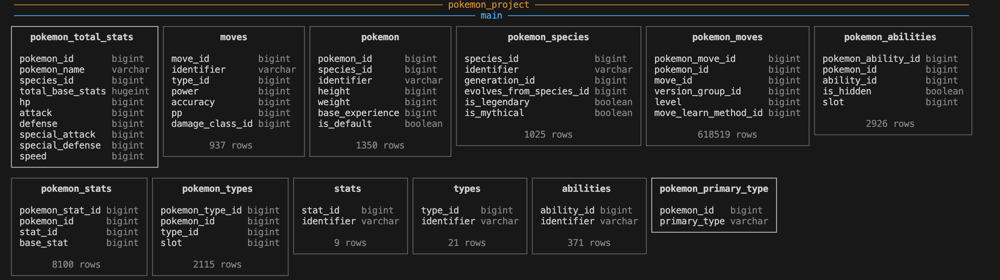
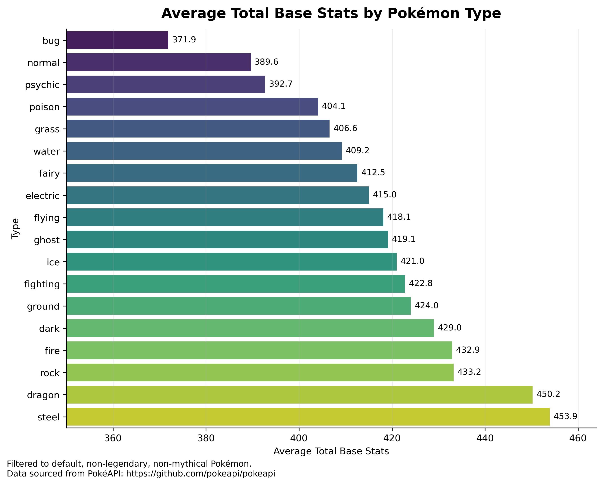

# Pokemon PokeAPI CSV Project

This project builds a complete local analytics pipeline using Pokémon data from the PokeAPI CSV dataset. The workflow reads raw CSV files stored on a local machine, performs data cleaning and validation using Python and pandas, loads the cleaned tables into DuckDB, and runs analytical SQL queries for exploration and reporting.

The project demonstrates a complete end-to-end data engineering and analytics workflow, including:

- Local CSV ingestion
- Data cleaning and transformation
- Relational database modeling
- Data quality validation
- DuckDB database ingestion
- SQL view creation
- Analytical querying
- Exporting analytical results

### DuckDB Table Structure


## Purpose of the Project

The goal of this project is to build a reproducible local ETL and analytics pipeline using Pokémon data from the PokeAPI dataset.

The project focuses on:
- transforming raw CSV files into structured relational tables,
- validating database integrity,
- storing cleaned data inside DuckDB,
- and performing SQL-based analysis on Pokémon statistics and type performance.

One of the main analytical questions explored in the project is:

> **Which Pokémon types have the highest average total base stats among non-legendary default Pokémon?**

The project demonstrates practical workflows commonly used in:
- data engineering,
- analytics engineering,
- relational database design,
- and SQL analytics.

## Repository Structure

```bash
eds213-database-lab
├── LICENSE
├── README.md
├── data
│   ├── abilities.csv
│   ├── moves.csv
│   ├── pokemon.csv
│   ├── pokemon_abilities.csv
│   ├── pokemon_moves.csv
│   ├── pokemon_species.csv
│   ├── pokemon_stats.csv
│   ├── pokemon_types.csv
│   ├── stats.csv
│   └── types.csv
├── data_viz.ipynb
├── environment.yml
├── final_pokemon_query.sql
├── output
│   ├── POKEMON-SQL-QUARY.png
│   ├── pokemon_tables.png
│   └── pokemon_type_avg_base_stats.png
├── pokemon_data.ipynb
├── pokemon_project.duckdb
├── requirements.txt
├── top_pokemon_by_stats.csv
└── type_strength_results.csv
```
## Data Access

This project uses Pokémon CSV datasets derived from the publicly available PokeAPI database.

The CSV files are stored locally inside the `data/` directory and are loaded directly into pandas during execution.

The datasets include:
- Pokémon information,
- Pokémon species,
- elemental types,
- moves,
- abilities,
- stats,
- and multiple relationship tables connecting these entities.

The original Pokémon data can be accessed through the official PokeAPI project:

- https://pokeapi.co/
- https://github.com/PokeAPI/pokeapi

## Workflow Overview

The project following workflow:

1. Read raw Pokémon CSV files from the local `data/` directory
2. Clean and standardize the datasets using pandas
3. Validate primary and foreign key relationships
4. Load cleaned tables into DuckDB
5. Create SQL views for analysis
6. Run analytical SQL queries on Pokémon statistics and types
7. Export final query results and visualizations

## How to Reproduce the Analysis

### Install Required Libraries

```bash
pip install pandas duckdb
```

### Run the Project

Run the notebook:

```bash
pokemon_data.ipynb
```

---

## Outputs

The project generates:

- `pokemon_project.duckdb` — local DuckDB database containing cleaned relational tables
- `type_strength_results.csv` — average total base stats by Pokémon type
- `top_pokemon_by_stats.csv` — Pokémon ranked by total stats
- `pokemon_type_avg_base_stats.png` — visualization of average base stats by type

---

## References & Acknowledgements

### Data Source

- https://pokeapi.co/
- https://github.com/PokeAPI/pokeapi

### Software & Libraries

- https://pandas.pydata.org/docs/
- https://duckdb.org/docs/

---

## Authorship

- Project Author: **Jay Kim**
- Course: **EDS 213**
- Instructors: **Julien Brun, Greg Janée, Annie Adams, Renata Curty**

## Project Output

### Pokémon Type Strength Visualization
